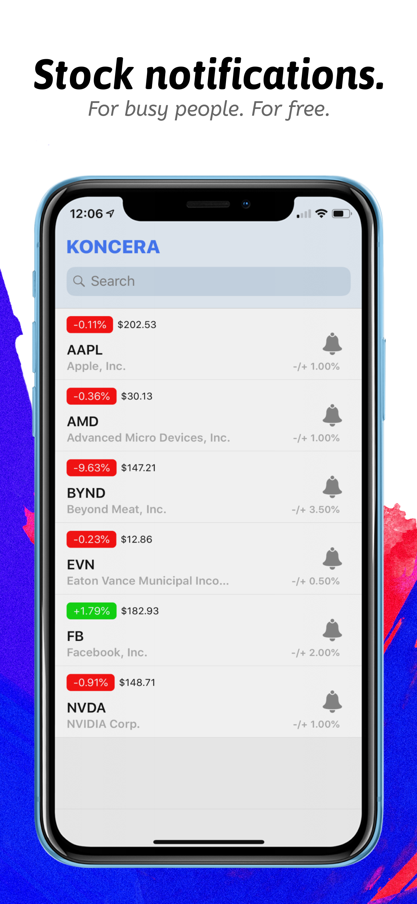
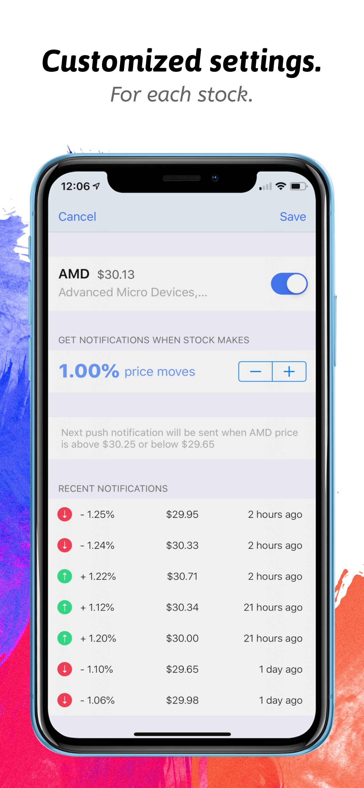
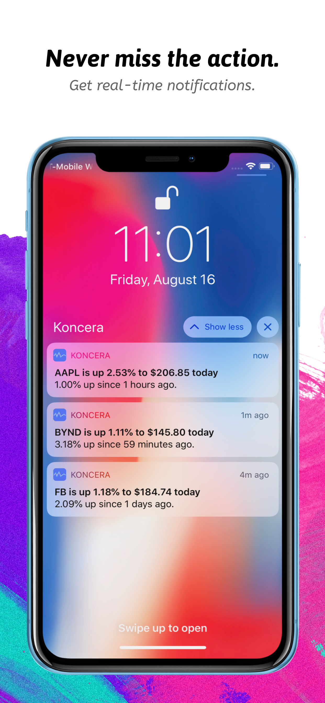

## Welcome to Koncera iOS app

The simplest but yet most efficient app to track your stock prices without losing your productivity!

Koncera sends you smart notifications when the prices of the stocks you follow change. 

Made for busy people who don't have time to manually check their stock prices but never want to miss out what's happening.

Download from the App Store:
https://apps.apple.com/us/app/koncera-stock-price-movements/id1469949208

### How Does It Work

For each stock you want to get notifications, you can choose a different price movement size to get notified. 

Whenever the stock price goes up or down since the last time you get notified, you will receive a push notification in real-time to your phone.

### Example

> Let's say that Apple stock price is now $200 you want to get notified on every 3.00% price movement. You will get the next push notification whenever the stock price is above $206 or below $194 after a couple of minutes, hours or days. 
Afterwards, the next push notification will be sent when Apple stock price moved 3% up or down since the last notification you received. And so on!

### Privacy
Koncera respects your privacy and does not collect any personal information. No sign-in required. 
Read our [privacy policy](https://koncera.flycricket.io/privacy.html) for more info.

### Screenshots

### Support or Contact

Having trouble with Koncera or feedback to share? Contact us via email [koncera@outlook.com](mailto:kocera@outlook.com)
